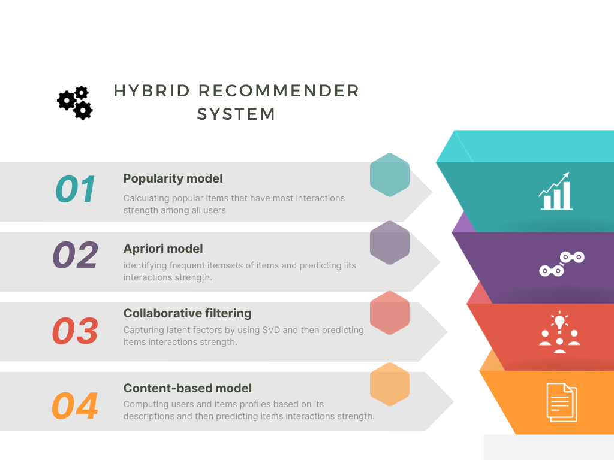
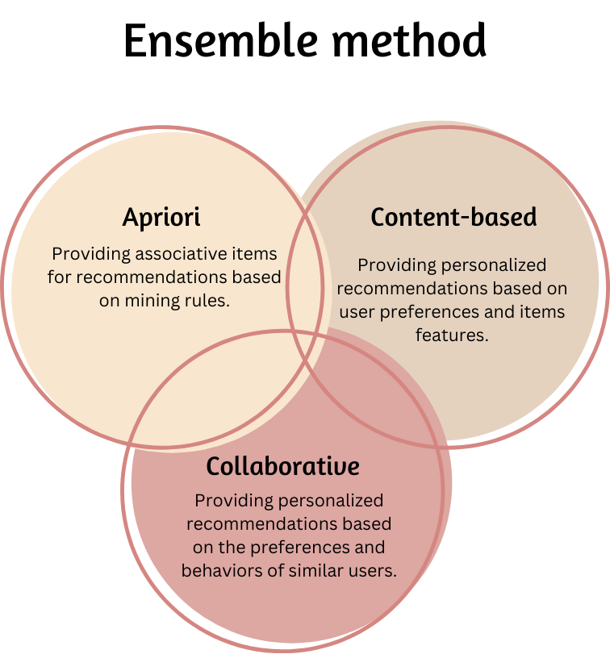
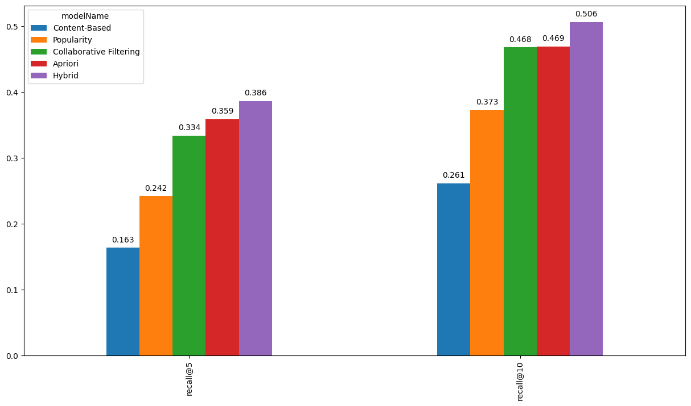

# Hybrid Recommendation System

Welcome to the repository for our hybrid recommendation system, featuring collaborative filtering with Singular Value Decomposition (SVD), content-based filtering using TF-IDF with a vectorizer, and association rule mining through the Apriori algorithm. This system not only combines diverse recommendation approaches but also includes real-time update functions for on-the-fly user additions, making it suitable for server environments demanding instant responses.

## Introduction

Our recommendation system aims to deliver personalized suggestions by seamlessly integrating collaborative filtering, content-based analysis, and association rule mining. The unique feature of this system lies in its ability to adapt to dynamic user profiles in real-time, making it well-suited for applications where user interactions change rapidly.


## Components


### Popularity Model

- Recommends popular items to users based on overall item popularity.
- Provides a simple yet effective baseline for comparison with personalized recommendation approaches.

### Association Rule Mining (Apriori Algorithm)

- The Apriori algorithm is used to discover association rules among items.
- This component aims to capture implicit relationships between items and improve the diversity of recommendations.

### Collaborative Filtering (SVD)

- Singular Value Decomposition (SVD) is used to factorize the user-item interaction matrix, capturing latent factors that represent user and item preferences.
- Implementation using the Surprise library for collaborative filtering.

### Content-Based Filtering (TF-IDF with Vectorizer)

- TF-IDF (Term Frequency-Inverse Document Frequency) is employed to represent the content features of items.
- A vectorizer is used to convert textual information into numerical features.
- This approach allows the system to recommend items based on their content similarity.

## Hybrid Model


- The recommendations from the collaborative filtering, content-based filtering, and association rule mining components are combined to form the hybrid model.
- The final recommendations are generated by considering the strengths of each individual model.

## Real-Time User Updates

- Using update_user_profile method of HybridRecommender class with the ID of user needed to update information.

## Results


- Evaluation metrics and comparisons of the hybrid model against individual models are provided.
- The hybrid model is demonstrated to outperform single models in terms of recommendation accuracy and coverage.
- Real-time user updates contribute to the adaptability and responsiveness of the recommendation engine.

## Usage

1. Clone the repository:

   ```bash
    git clone https://github.com/tuansunday05/ArticleRecommenderSystem.git

2. Go to root folder:

   ```bash
   cd ArticleRecommenderSystem/

3. Install dependencies

   ```bash
    pip install -r requirements.txt

4. Run the recommender engine:
   ```bash
    python3 scripts/models/hybrid_developing.py

## License

This project is licensed under the [**MIT License**](https://github.com/tuansunday05/ArticleRecommenderSystem/blob/master/LICENSE).